# AmiBot Technical Diagrams and Architecture

This document contains detailed technical diagrams and architecture documentation for AmiBot.

## Table of Contents
1. [Class Diagram](#class-diagram)
2. [Sequence Diagrams](#sequence-diagrams)
3. [State Diagrams](#state-diagrams)
4. [Data Flow Diagrams](#data-flow-diagrams)
5. [Deployment Architecture](#deployment-architecture)

---

## Class Diagram

### Complete Class Hierarchy

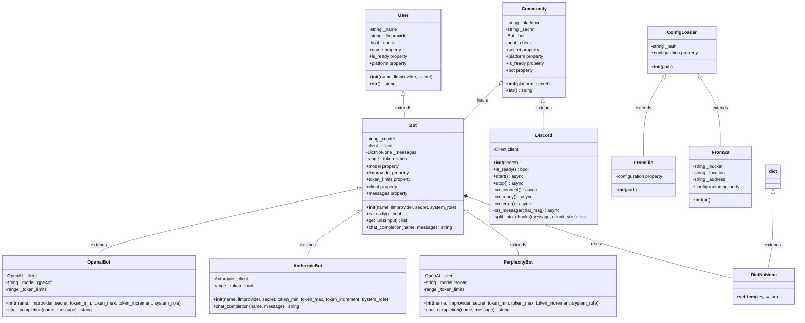

---

## Sequence Diagrams

### 1. Application Startup Sequence

```mermaid
sequenceDiagram
    participant Main as __main__.py
    participant Parser as argparse
    participant Loader as ConfigLoader
    participant BotFactory as Bot Factory
    participant Bot as Bot Instance
    participant Community as Discord
    participant FastAPI as Health API
    participant Loop as Event Loop

    Main->>Parser: Parse CLI arguments
    Parser-->>Main: args (config path)

    Main->>Main: Analyze config protocol
    alt S3 Protocol
        Main->>Loader: FromS3(url)
    else File Protocol
        Main->>Loader: FromFile(path)
    end

    Loader->>Loader: Load YAML config
    Loader-->>Main: configuration dict

    Main->>BotFactory: Match provider type
    alt OpenAI
        BotFactory->>Bot: OpenaiBot(params)
    else Anthropic
        BotFactory->>Bot: AnthropicBot(params)
    else Perplexity
        BotFactory->>Bot: PerplexityBot(params)
    end

    Bot->>Bot: Initialize client
    Bot->>Bot: Setup system_role
    Bot-->>Main: bot instance

    Main->>Community: Discord(token)
    Community->>Community: Setup Discord client
    Community->>Community: Register event handlers
    Community-->>Main: community instance

    Main->>Community: Set bot property
    Community-->>Main: Bot injected

    Main->>FastAPI: Create FastAPI app
    Main->>FastAPI: Setup /liveness endpoint
    Main->>FastAPI: Setup /readiness endpoint

    Main->>Loop: Create event loop
    Main->>Loop: Start community.start()
    Main->>Loop: Start api_server.serve()

    Loop->>Community: Run Discord client
    Loop->>FastAPI: Run health API
```

### 2. Message Handling Flow

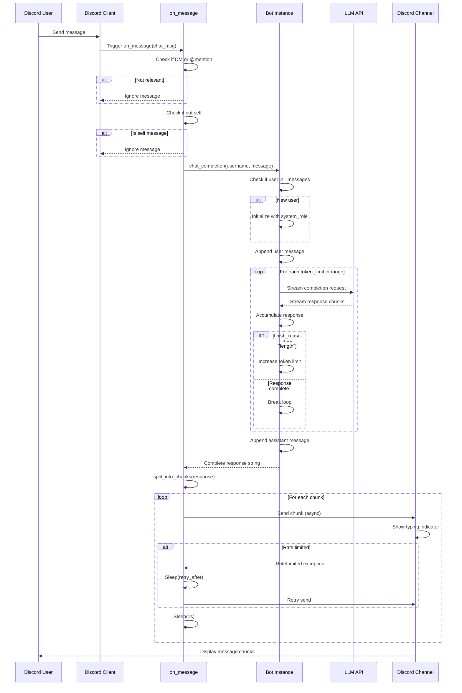

### 3. Progressive Token Strategy Flow

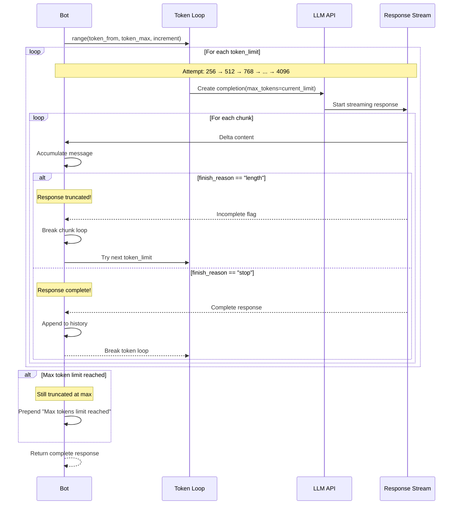

### 4. Configuration Loading Flow

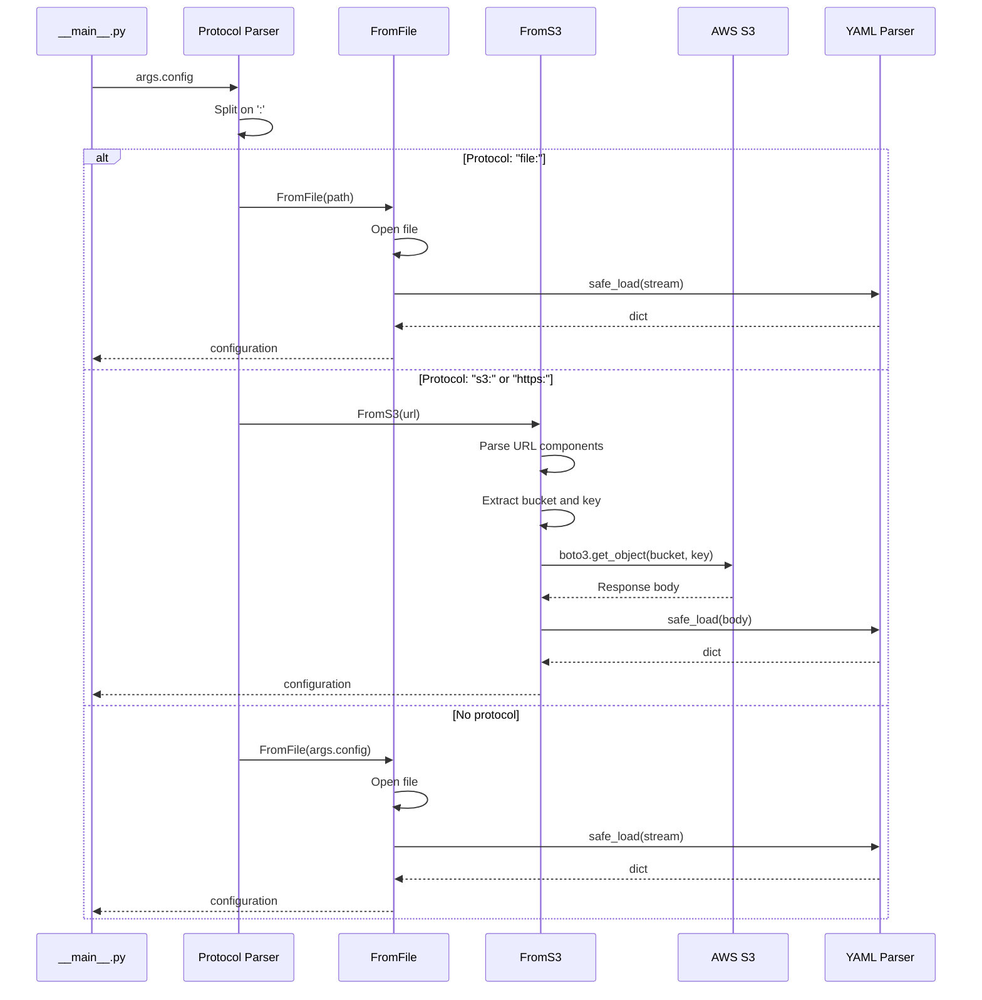

### 5. Health Check Flow

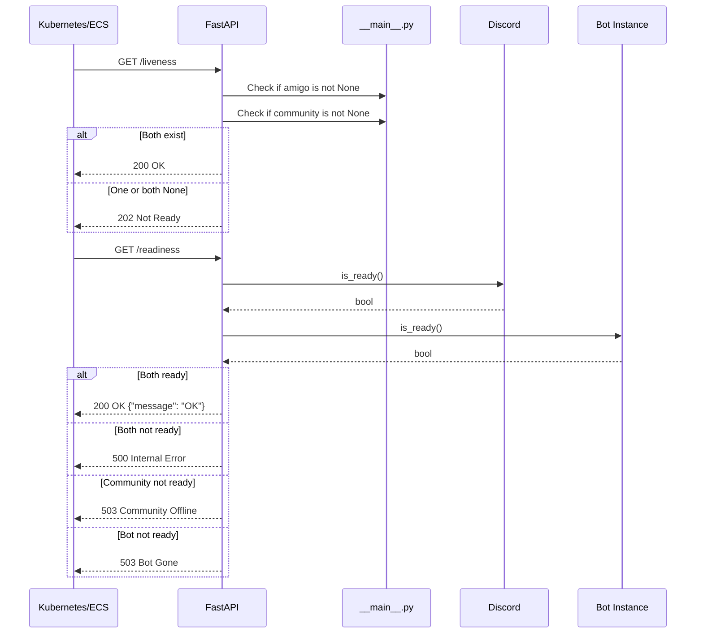

---

## State Diagrams

### Bot Lifecycle States

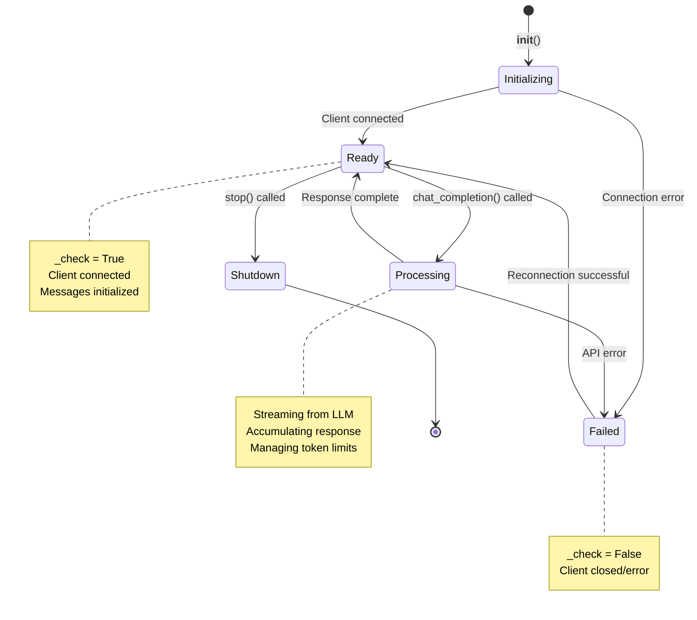

### Discord Client States

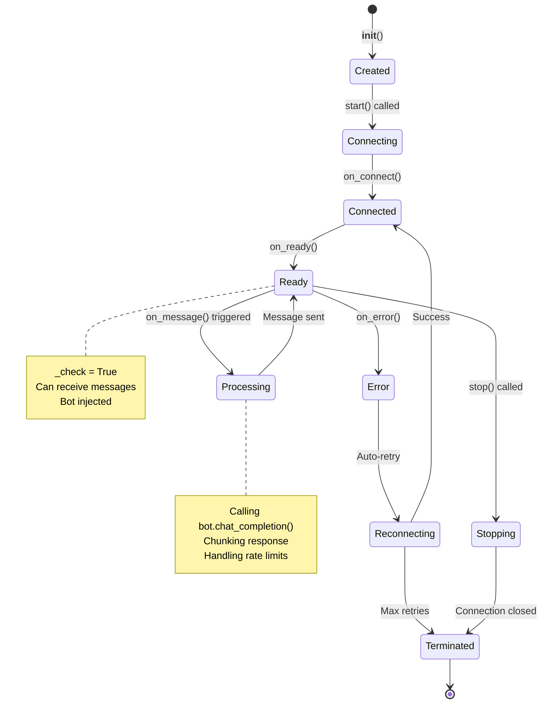

---

## Data Flow Diagrams

### Conversation Context Management

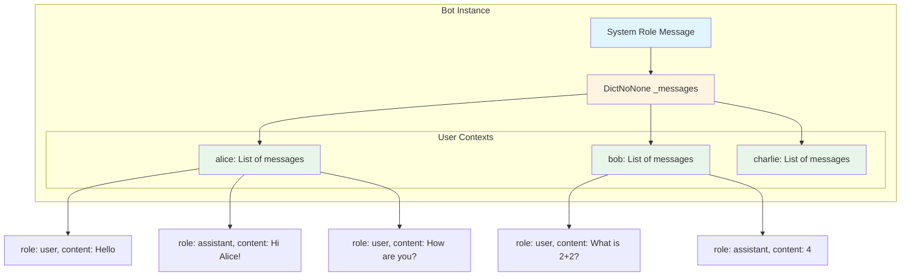

### Message Flow Through System

```mermaid
graph LR
    A[Discord User] --> B{Discord Client}
    B --> C{Message Filter}

    C -->|DM| D[Bot.chat_completion]
    C -->|@mention| D
    C -->|@everyone| D
    C -->|Ignore| E[Drop]

    D --> F{User Context Exists?}
    F -->|No| G[Create with System Role]
    F -->|Yes| H[Append to Existing]

    G --> I[Add User Message]
    H --> I

    I --> J{Token Loop}

    J --> K[LLM API Call]
    K --> L{Response Complete?}

    L -->|No - Truncated| M[Increase Token Limit]
    M --> J

    L -->|Yes - Complete| N[Append Assistant Reply]

    N --> O[Split into 2000-char Chunks]
    O --> P[Send to Discord Channel]

    P --> Q{Rate Limited?}
    Q -->|Yes| R[Sleep & Retry]
    Q -->|No| S[Next Chunk]

    R --> P
    S --> T[Complete]

    style D fill:#ffebee
    style K fill:#e3f2fd
    style N fill:#e8f5e9
    style P fill:#f3e5f5
```

---

## Deployment Architecture

### Kubernetes Deployment

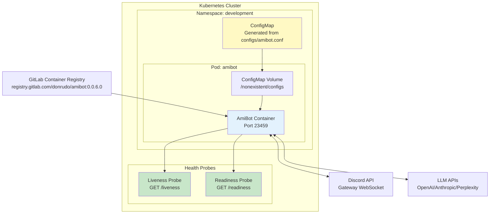

### AWS ECS Deployment

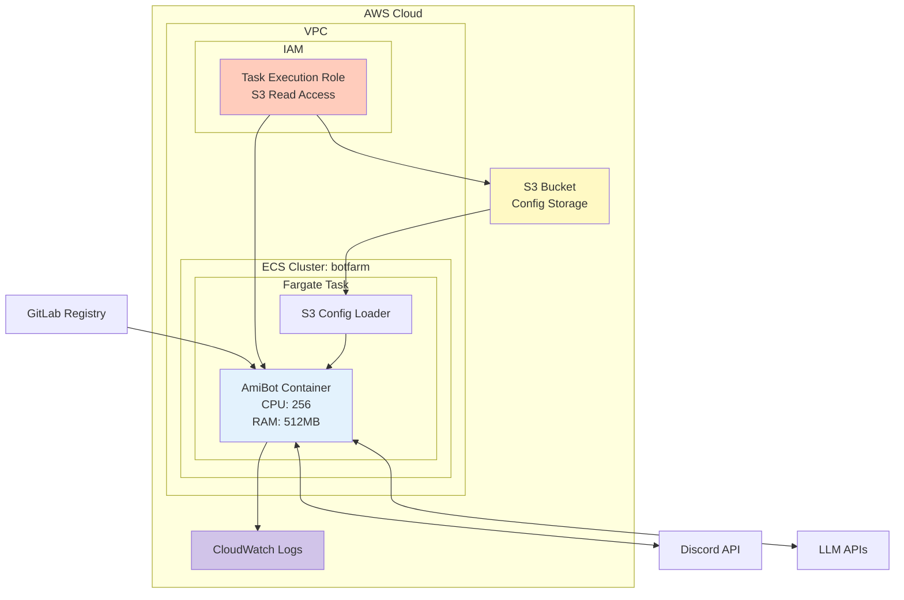

### CI/CD Pipeline Flow

```mermaid
graph LR
    A[Git Push] --> B[CircleCI Triggered]

    B --> C[Job: prepare]
    C --> D[Generate terraform.tfvars<br/>from cloud_settings.json]
    D --> E[Persist to Workspace]

    E --> F[Job: terraform-plan]
    F --> G[terraform init]
    G --> H[terraform plan]
    H --> I[Persist Plan]

    I --> J[Job: terraform-approve<br/>Manual Gate]

    J -->|Approved| K[Job: terraform-apply]
    K --> L[terraform apply]
    L --> M[Update ECS Service]
    M --> N[Deploy New Task]

    J -->|Rejected| O[Stop Pipeline]

    style C fill:#e3f2fd
    style F fill:#fff9c4
    style J fill:#ffccbc
    style K fill:#c8e6c9
```

---

## Component Interaction Diagram

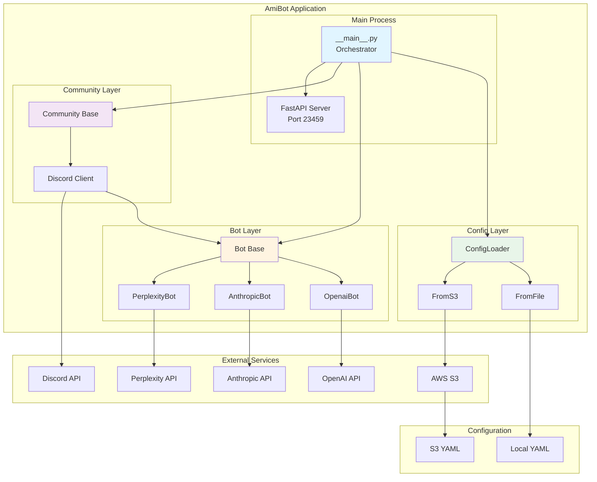

---

## DictNoNone Custom Data Structure

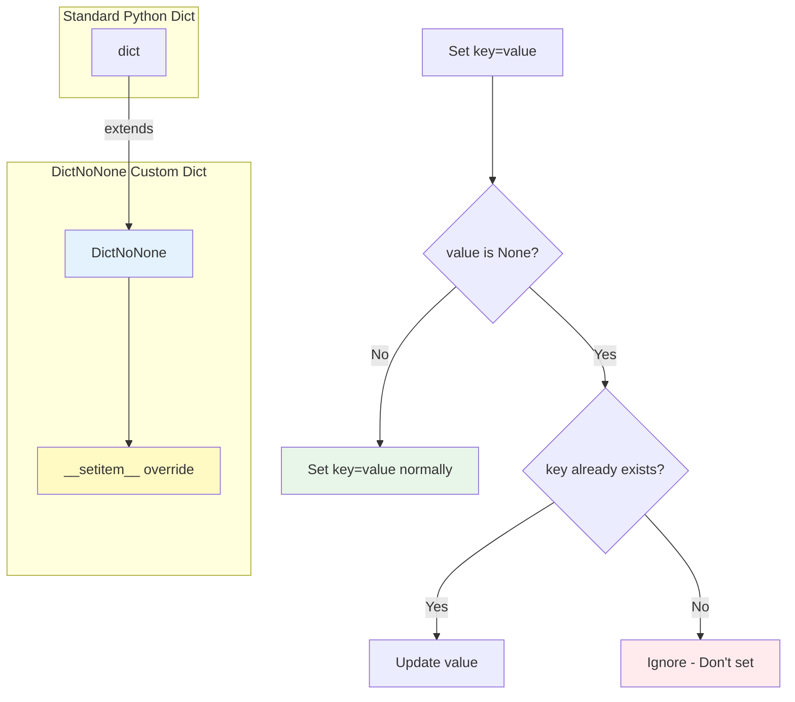

**Purpose**: Prevents `None` values from polluting message histories. If a key doesn't exist and you try to set it to `None`, the operation is ignored.

**Example**:
```python
messages = DictNoNone()
messages['user1'] = None      # Ignored - key not created
messages['user1'] = []        # Accepted - key created with empty list
messages['user1'] = None      # Accepted - key exists, can be updated
```

---

## Progressive Token Allocation Strategy

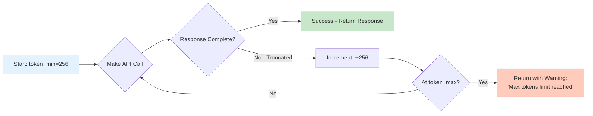

**Benefits**:
- **Cost Optimization**: Start with minimum tokens, only increase when needed
- **Quality Assurance**: Retry with more tokens if response truncated
- **Transparency**: Warn user when max limit reached

**Example Configuration**:
```yaml
tokens_range:
  from: 256        # Start cheap
  until: 4096      # Allow quality
  increment: 256   # Gradual increase
```

**Token Progression**: 256 → 512 → 768 → 1024 → 1280 → ... → 4096

---

## Error Handling Patterns

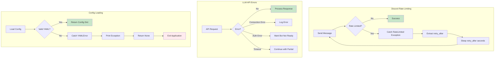

---

## Concurrency Model

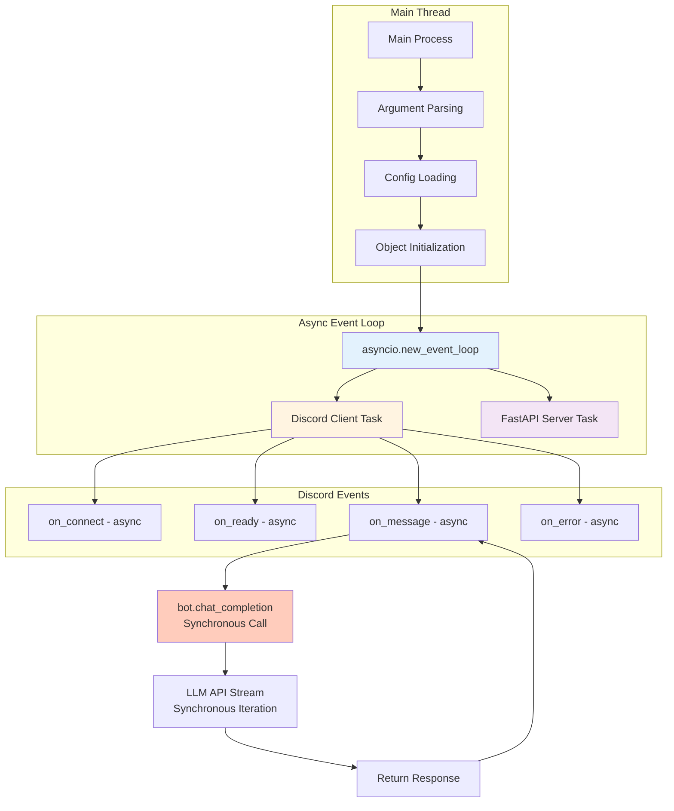

**Key Points**:
- **Event Loop**: Single async event loop runs both Discord client and FastAPI
- **Discord Handlers**: All event handlers are `async` functions
- **Bot Methods**: `chat_completion()` is synchronous (blocking)
- **LLM Streaming**: Synchronous iteration over response chunks
- **Concurrency**: Multiple users can interact, but each conversation is processed sequentially

---

This document provides comprehensive technical diagrams for understanding AmiBot's architecture, data flows, and operational patterns.
