# AmiBot Technical Diagrams and Architecture

This document contains detailed technical diagrams and architecture documentation for AmiBot.

## Table of Contents
1. [Class Diagram](#class-diagram)
2. [Sequence Diagrams](#sequence-diagrams)
3. [State Diagrams](#state-diagrams)
4. [Data Flow Diagrams](#data-flow-diagrams)
5. [Deployment Architecture](#deployment-architecture)

---

## Class Diagram

### Complete Class Hierarchy

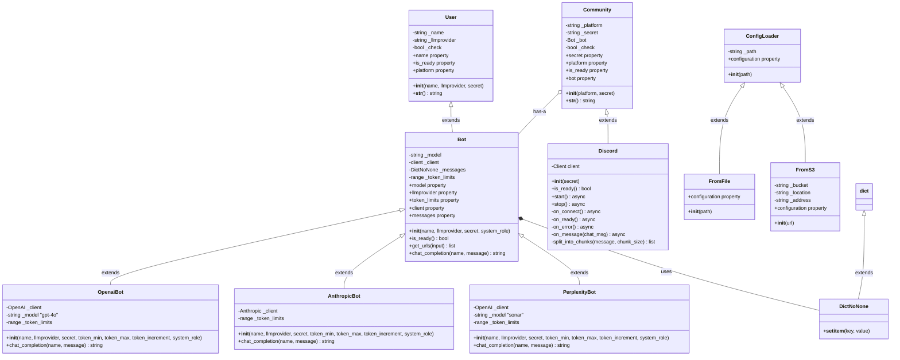
```mermaid
classDiagram
    %% Base Classes
    class User {
        -string _name
        -string _llmprovider
        -bool _check
        +__init__(name, llmprovider, secret)
        +__str__() string
        +name property
        +is_ready property
        +platform property
    }

    class Bot {
        -string _model
        -client _client
        -DictNoNone _messages
        -range _token_limits
        +__init__(name, llmprovider, secret, system_role)
        +model property
        +llmprovider property
        +token_limits property
        +client property
        +messages property
        +is_ready() bool
        +get_urls(input) list
        +chat_completion(name, message) string
    }

    class DictNoNone {
        +__setitem__(key, value)
    }

    class OpenaiBot {
        -OpenAI _client
        -string _model "gpt-4o"
        -range _token_limits
        +__init__(name, llmprovider, secret, token_min, token_max, token_increment, system_role)
        +chat_completion(name, message) string
    }

    class AnthropicBot {
        -Anthropic _client
        -range _token_limits
        +__init__(name, llmprovider, secret, token_min, token_max, token_increment, system_role)
        +chat_completion(name, message) string
    }

    class PerplexityBot {
        -OpenAI _client
        -string _model "sonar"
        -range _token_limits
        +__init__(name, llmprovider, secret, token_min, token_max, token_increment, system_role)
        +chat_completion(name, message) string
    }

    %% Community Classes
    class Community {
        -string _platform
        -string _secret
        -Bot _bot
        -bool _check
        +__init__(platform, secret)
        +__str__() string
        +secret property
        +platform property
        +is_ready property
        +bot property
    }

    class Discord {
        -Client client
        +__init__(secret)
        +is_ready() bool
        +start() async
        +stop() async
        -on_connect() async
        -on_ready() async
        -on_error() async
        -on_message(chat_msg) async
        -split_into_chunks(message, chunk_size) list
    }

    %% Config Loader Classes
    class ConfigLoader {
        -string _path
        +__init__(path)
        +configuration property
    }

    class FromFile {
        +__init__(path)
        +configuration property
    }

    class FromS3 {
        -string _bucket
        -string _location
        -string _address
        +__init__(url)
        +configuration property
    }

    %% Relationships
    User <|-- Bot : extends
    Bot <|-- OpenaiBot : extends
    Bot <|-- AnthropicBot : extends
    Bot <|-- PerplexityBot : extends
    Bot *-- DictNoNone : uses
    Community <|-- Discord : extends
    Community o-- Bot : has-a
    ConfigLoader <|-- FromFile : extends
    ConfigLoader <|-- FromS3 : extends
    dict <|-- DictNoNone : extends
```

---

## Sequence Diagrams

### 1. Application Startup Sequence

```mermaid
sequenceDiagram
    participant Main as __main__.py
    participant Parser as argparse
    participant Loader as ConfigLoader
    participant BotFactory as Bot Factory
    participant Bot as Bot Instance
    participant Community as Discord
    participant FastAPI as Health API
    participant Loop as Event Loop

    Main->>Parser: Parse CLI arguments
    Parser-->>Main: args (config path)

    Main->>Main: Analyze config protocol
    alt S3 Protocol
        Main->>Loader: FromS3(url)
    else File Protocol
        Main->>Loader: FromFile(path)
    end

    Loader->>Loader: Load YAML config
    Loader-->>Main: configuration dict

    Main->>BotFactory: Match provider type
    alt OpenAI
        BotFactory->>Bot: OpenaiBot(params)
    else Anthropic
        BotFactory->>Bot: AnthropicBot(params)
    else Perplexity
        BotFactory->>Bot: PerplexityBot(params)
    end

    Bot->>Bot: Initialize client
    Bot->>Bot: Setup system_role
    Bot-->>Main: bot instance

    Main->>Community: Discord(token)
    Community->>Community: Setup Discord client
    Community->>Community: Register event handlers
    Community-->>Main: community instance

    Main->>Community: Set bot property
    Community-->>Main: Bot injected

    Main->>FastAPI: Create FastAPI app
    Main->>FastAPI: Setup /liveness endpoint
    Main->>FastAPI: Setup /readiness endpoint

    Main->>Loop: Create event loop
    Main->>Loop: Start community.start()
    Main->>Loop: Start api_server.serve()

    Loop->>Community: Run Discord client
    Loop->>FastAPI: Run health API
```

### 2. Message Handling Flow

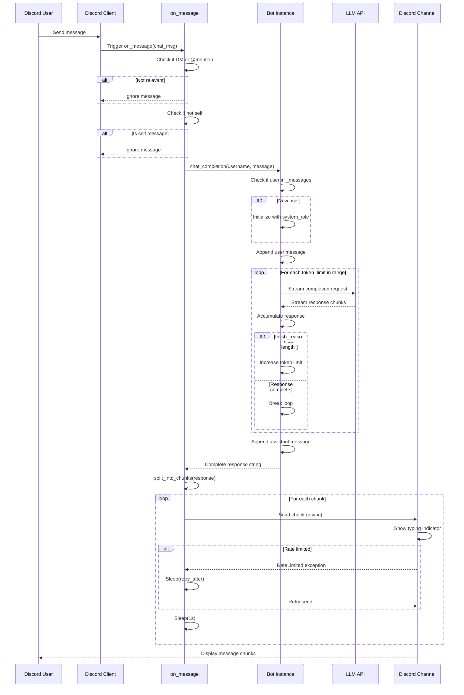
```mermaid
sequenceDiagram
    participant User as Discord User
    participant Discord as Discord Client
    participant Handler as on_message
    participant Bot as Bot Instance
    participant LLM as LLM API
    participant Response as Discord Channel

    User->>Discord: Send message
    Discord->>Handler: Trigger on_message(chat_msg)

    Handler->>Handler: Check if DM or @mention
    alt Not relevant
        Handler-->>Discord: Ignore message
    end

    Handler->>Handler: Check if not self
    alt Is self message
        Handler-->>Discord: Ignore message
    end

    Handler->>Bot: chat_completion(username, message)

    Bot->>Bot: Check if user in _messages
    alt New user
        Bot->>Bot: Initialize with system_role
    end

    Bot->>Bot: Append user message

    loop For each token_limit in range
        Bot->>LLM: Stream completion request
        LLM-->>Bot: Stream response chunks

        Bot->>Bot: Accumulate response

        alt finish_reason == "length"
            Bot->>Bot: Increase token limit
        else Response complete
            Bot->>Bot: Break loop
        end
    end

    Bot->>Bot: Append assistant message
    Bot-->>Handler: Complete response string

    Handler->>Handler: split_into_chunks(response)

    loop For each chunk
        Handler->>Response: Send chunk (async)
        Response->>Response: Show typing indicator
        alt Rate limited
            Response-->>Handler: RateLimited exception
            Handler->>Handler: Sleep(retry_after)
            Handler->>Response: Retry send
        end
        Handler->>Handler: Sleep(1s)
    end

    Response-->>User: Display message chunks
```

### 3. Progressive Token Strategy Flow

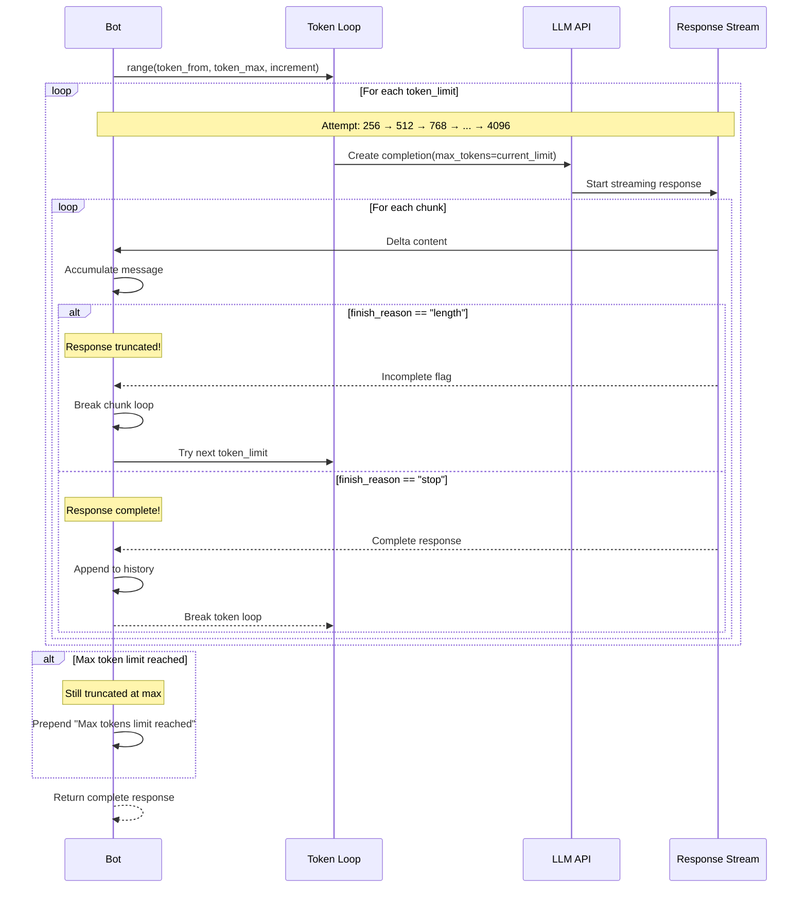
```mermaid
sequenceDiagram
    participant Bot
    participant TokenLoop as Token Loop
    participant LLM as LLM API
    participant Stream as Response Stream

    Bot->>TokenLoop: range(token_from, token_max, increment)

    loop For each token_limit
        Note over Bot,Stream: Attempt: 256 → 512 → 768 → ... → 4096

        TokenLoop->>LLM: Create completion(max_tokens=current_limit)
        LLM->>Stream: Start streaming response

        loop For each chunk
            Stream->>Bot: Delta content
            Bot->>Bot: Accumulate message

            alt finish_reason == "length"
                Note over Bot: Response truncated!
                Stream-->>Bot: Incomplete flag
                Bot->>Bot: Break chunk loop
                Bot->>TokenLoop: Try next token_limit
            else finish_reason == "stop"
                Note over Bot: Response complete!
                Stream-->>Bot: Complete response
                Bot->>Bot: Append to history
                Bot-->>TokenLoop: Break token loop
            end
        end
    end

    alt Max token limit reached
        Note over Bot: Still truncated at max
        Bot->>Bot: Prepend "Max tokens limit reached"
    end

    Bot-->>Bot: Return complete response
```

### 4. Configuration Loading Flow

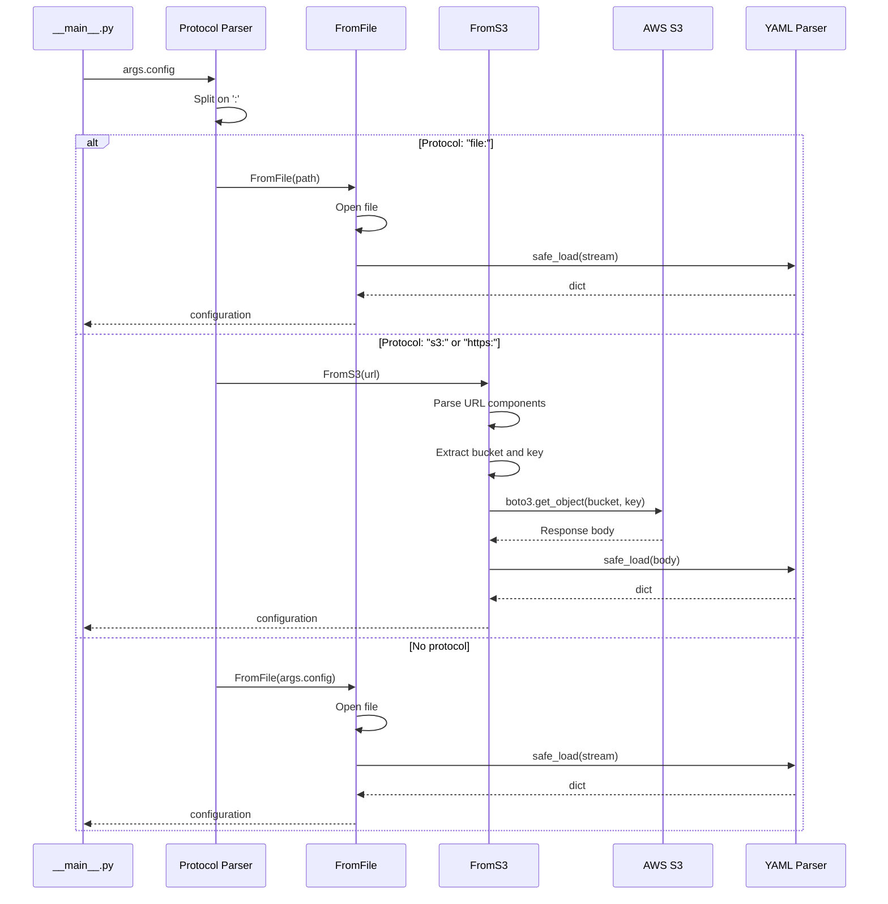
```mermaid
sequenceDiagram
    participant Main as __main__.py
    participant Parser as Protocol Parser
    participant FromFile
    participant FromS3
    participant S3 as AWS S3
    participant YAML as YAML Parser

    Main->>Parser: args.config

    Parser->>Parser: Split on ':'

    alt Protocol: "file:"
        Parser->>FromFile: FromFile(path)
        FromFile->>FromFile: Open file
        FromFile->>YAML: safe_load(stream)
        YAML-->>FromFile: dict
        FromFile-->>Main: configuration
    else Protocol: "s3:" or "https:"
        Parser->>FromS3: FromS3(url)
        FromS3->>FromS3: Parse URL components
        FromS3->>FromS3: Extract bucket and key
        FromS3->>S3: boto3.get_object(bucket, key)
        S3-->>FromS3: Response body
        FromS3->>YAML: safe_load(body)
        YAML-->>FromS3: dict
        FromS3-->>Main: configuration
    else No protocol
        Parser->>FromFile: FromFile(args.config)
        FromFile->>FromFile: Open file
        FromFile->>YAML: safe_load(stream)
        YAML-->>FromFile: dict
        FromFile-->>Main: configuration
    end
```

### 5. Health Check Flow

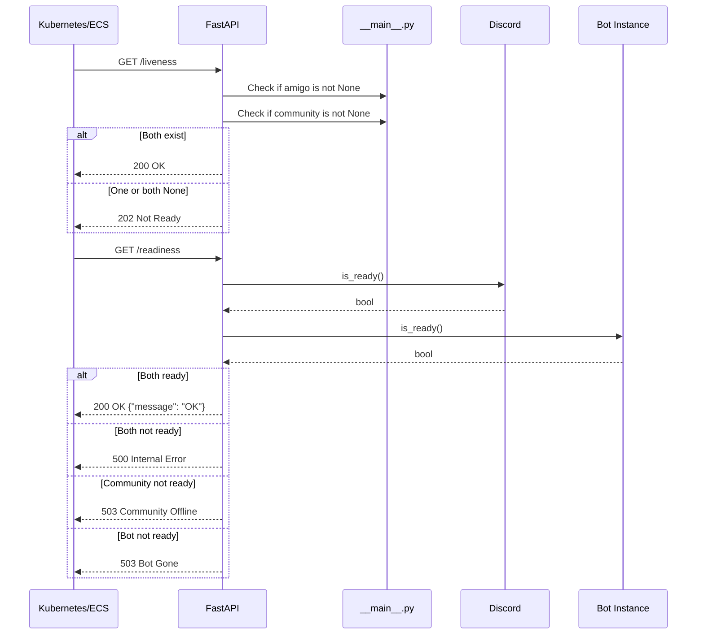
```mermaid
sequenceDiagram
    participant K8s as Kubernetes/ECS
    participant API as FastAPI
    participant Main as __main__.py
    participant Community as Discord
    participant Bot as Bot Instance

    K8s->>API: GET /liveness
    API->>Main: Check if amigo is not None
    API->>Main: Check if community is not None
    alt Both exist
        API-->>K8s: 200 OK
    else One or both None
        API-->>K8s: 202 Not Ready
    end

    K8s->>API: GET /readiness
    API->>Community: is_ready()
    Community-->>API: bool
    API->>Bot: is_ready()
    Bot-->>API: bool

    alt Both ready
        API-->>K8s: 200 OK {"message": "OK"}
    else Both not ready
        API-->>K8s: 500 Internal Error
    else Community not ready
        API-->>K8s: 503 Community Offline
    else Bot not ready
        API-->>K8s: 503 Bot Gone
    end
```

---

## State Diagrams

### Bot Lifecycle States

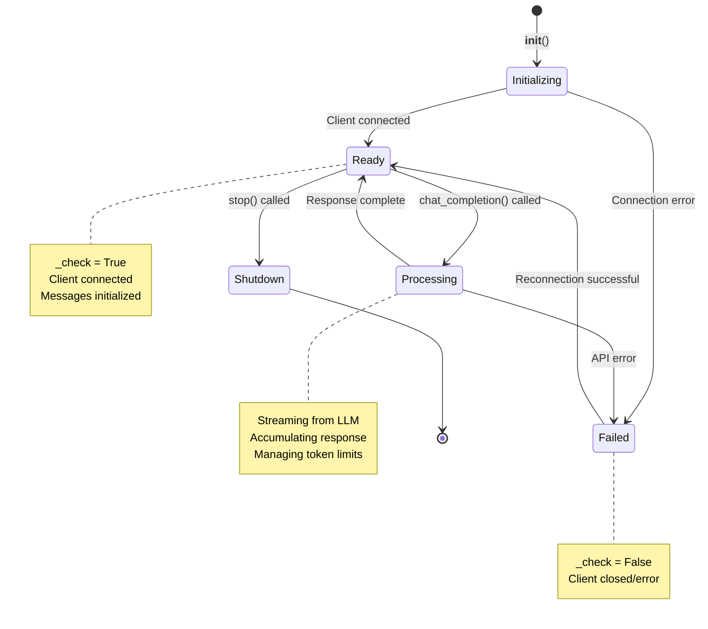
```mermaid
stateDiagram-v2
    [*] --> Initializing: __init__()

    Initializing --> Ready: Client connected
    Initializing --> Failed: Connection error

    Ready --> Processing: chat_completion() called
    Processing --> Ready: Response complete
    Processing --> Failed: API error

    Failed --> Ready: Reconnection successful

    Ready --> Shutdown: stop() called
    Shutdown --> [*]

    note right of Ready
        _check = True
        Client connected
        Messages initialized
    end note

    note right of Processing
        Streaming from LLM
        Accumulating response
        Managing token limits
    end note

    note right of Failed
        _check = False
        Client closed/error
    end note
```

### Discord Client States

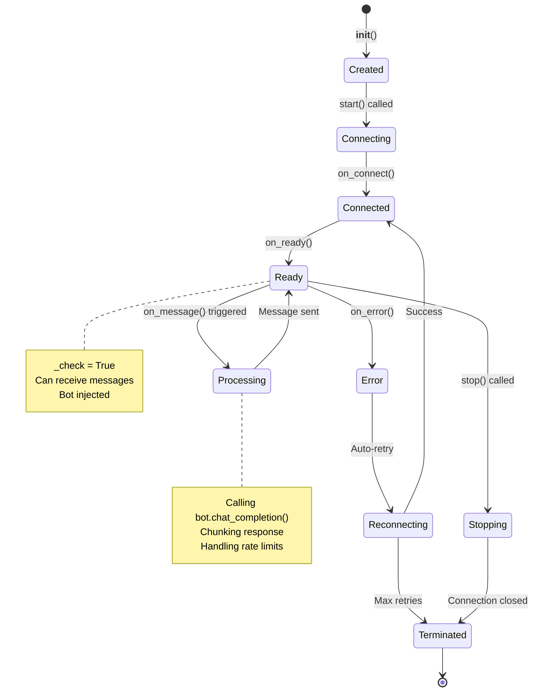
```mermaid
stateDiagram-v2
    [*] --> Created: __init__()

    Created --> Connecting: start() called
    Connecting --> Connected: on_connect()
    Connected --> Ready: on_ready()

    Ready --> Processing: on_message() triggered
    Processing --> Ready: Message sent

    Ready --> Error: on_error()
    Error --> Reconnecting: Auto-retry
    Reconnecting --> Connected: Success
    Reconnecting --> Terminated: Max retries

    Ready --> Stopping: stop() called
    Stopping --> Terminated: Connection closed
    Terminated --> [*]

    note right of Ready
        _check = True
        Can receive messages
        Bot injected
    end note

    note right of Processing
        Calling bot.chat_completion()
        Chunking response
        Handling rate limits
    end note
```

---

## Data Flow Diagrams

### Conversation Context Management

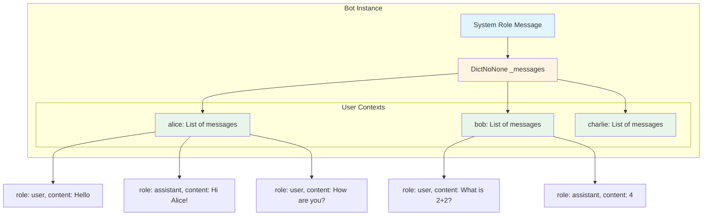
```mermaid
graph TB
    subgraph Bot Instance
        SystemRole[System Role Message]
        Messages[DictNoNone _messages]

        subgraph User Contexts
            User1[alice: List of messages]
            User2[bob: List of messages]
            User3[charlie: List of messages]
        end
    end

    SystemRole --> Messages
    Messages --> User1
    Messages --> User2
    Messages --> User3

    User1 --> Msg1A[role: user, content: Hello]
    User1 --> Msg1B[role: assistant, content: Hi Alice!]
    User1 --> Msg1C[role: user, content: How are you?]

    User2 --> Msg2A[role: user, content: What is 2+2?]
    User2 --> Msg2B[role: assistant, content: 4]

    style SystemRole fill:#e1f5ff
    style Messages fill:#fff4e1
    style User1 fill:#e8f5e9
    style User2 fill:#e8f5e9
    style User3 fill:#e8f5e9
```

### Message Flow Through System

```mermaid
graph LR
    A[Discord User] --> B{Discord Client}
    B --> C{Message Filter}

    C -->|DM| D[Bot.chat_completion]
    C -->|@mention| D
    C -->|@everyone| D
    C -->|Ignore| E[Drop]

    D --> F{User Context Exists?}
    F -->|No| G[Create with System Role]
    F -->|Yes| H[Append to Existing]

    G --> I[Add User Message]
    H --> I

    I --> J{Token Loop}

    J --> K[LLM API Call]
    K --> L{Response Complete?}

    L -->|No - Truncated| M[Increase Token Limit]
    M --> J

    L -->|Yes - Complete| N[Append Assistant Reply]

    N --> O[Split into 2000-char Chunks]
    O --> P[Send to Discord Channel]

    P --> Q{Rate Limited?}
    Q -->|Yes| R[Sleep & Retry]
    Q -->|No| S[Next Chunk]

    R --> P
    S --> T[Complete]

    style D fill:#ffebee
    style K fill:#e3f2fd
    style N fill:#e8f5e9
    style P fill:#f3e5f5
```

---

## Deployment Architecture

### Kubernetes Deployment

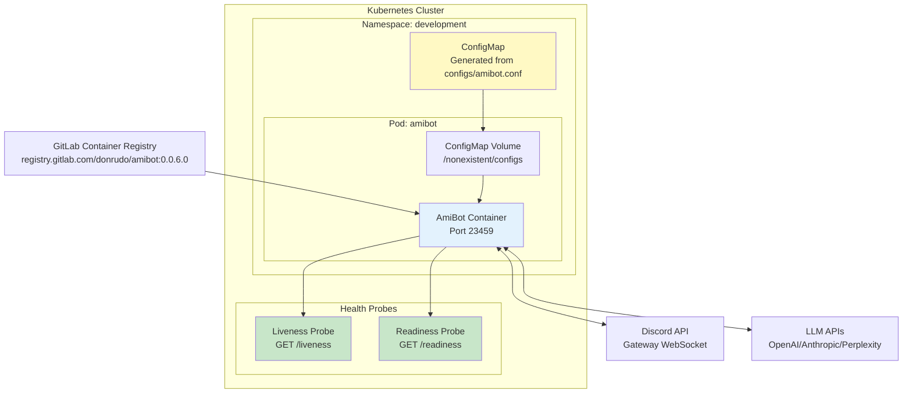
```mermaid
graph TB
    subgraph Kubernetes Cluster
        subgraph Namespace: development
            subgraph Pod: amibot
                Container[AmiBot Container<br/>Port 23459]
                ConfigMount[ConfigMap Volume<br/>/nonexistent/configs]
            end

            ConfigMap[ConfigMap<br/>Generated from configs/amibot.conf]
        end

        subgraph Health Probes
            Liveness[Liveness Probe<br/>GET /liveness]
            Readiness[Readiness Probe<br/>GET /readiness]
        end
    end

    Registry[GitLab Container Registry<br/>registry.gitlab.com/donrudo/amibot:0.0.6.0]
    Discord[Discord API<br/>Gateway WebSocket]
    LLM[LLM APIs<br/>OpenAI/Anthropic/Perplexity]

    Registry --> Container
    ConfigMap --> ConfigMount
    ConfigMount --> Container
    Container --> Liveness
    Container --> Readiness
    Container <--> Discord
    Container <--> LLM

    style Container fill:#e3f2fd
    style ConfigMap fill:#fff9c4
    style Liveness fill:#c8e6c9
    style Readiness fill:#c8e6c9
```

### AWS ECS Deployment

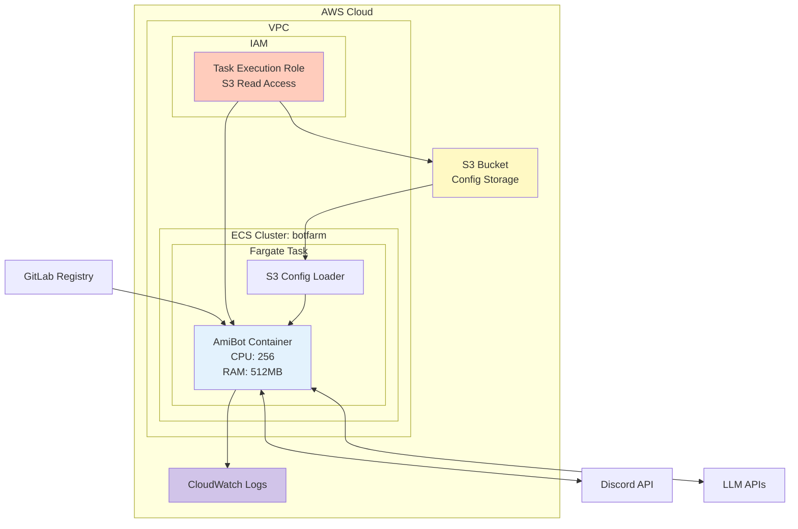
```mermaid
graph TB
    subgraph AWS Cloud
        subgraph VPC
            subgraph ECS Cluster: botfarm
                subgraph Fargate Task
                    Container[AmiBot Container<br/>CPU: 256<br/>RAM: 512MB]
                    S3Config[S3 Config Loader]
                end
            end

            subgraph IAM
                TaskRole[Task Execution Role<br/>S3 Read Access]
            end
        end

        S3Bucket[S3 Bucket<br/>Config Storage]
        CloudWatch[CloudWatch Logs]
    end

    Registry[GitLab Registry]
    Discord[Discord API]
    LLM[LLM APIs]

    Registry --> Container
    TaskRole --> Container
    TaskRole --> S3Bucket
    S3Bucket --> S3Config
    S3Config --> Container
    Container --> CloudWatch
    Container <--> Discord
    Container <--> LLM

    style Container fill:#e3f2fd
    style S3Bucket fill:#fff9c4
    style TaskRole fill:#ffccbc
    style CloudWatch fill:#d1c4e9
```

### CI/CD Pipeline Flow


```mermaid
graph LR
    A[Git Push] --> B[CircleCI Triggered]

    B --> C[Job: prepare]
    C --> D[Generate terraform.tfvars<br/>from cloud_settings.json]
    D --> E[Persist to Workspace]

    E --> F[Job: terraform-plan]
    F --> G[terraform init]
    G --> H[terraform plan]
    H --> I[Persist Plan]

    I --> J[Job: terraform-approve<br/>Manual Gate]

    J -->|Approved| K[Job: terraform-apply]
    K --> L[terraform apply]
    L --> M[Update ECS Service]
    M --> N[Deploy New Task]

    J -->|Rejected| O[Stop Pipeline]

    style C fill:#e3f2fd
    style F fill:#fff9c4
    style J fill:#ffccbc
    style K fill:#c8e6c9
```

---

## Component Interaction Diagram

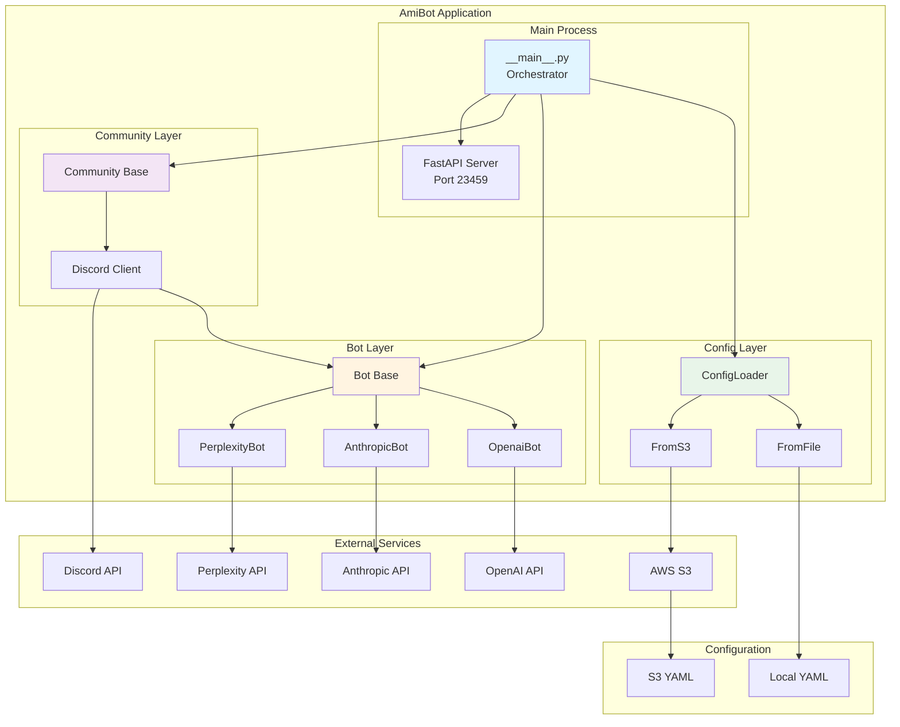
```mermaid
graph TB
    subgraph External Services
        DiscordAPI[Discord API]
        OpenAIAPI[OpenAI API]
        AnthropicAPI[Anthropic API]
        PerplexityAPI[Perplexity API]
        S3[AWS S3]
    end

    subgraph AmiBot Application
        subgraph Main Process
            MainPy[__main__.py<br/>Orchestrator]
            FastAPI[FastAPI Server<br/>Port 23459]
        end

        subgraph Bot Layer
            Bot[Bot Base]
            OpenAI[OpenaiBot]
            Anthropic[AnthropicBot]
            Perplexity[PerplexityBot]
        end

        subgraph Community Layer
            Community[Community Base]
            DiscordClient[Discord Client]
        end

        subgraph Config Layer
            ConfigLoader[ConfigLoader]
            FromFile[FromFile]
            FromS3[FromS3]
        end
    end

    subgraph Configuration
        LocalFile[Local YAML]
        S3File[S3 YAML]
    end

    MainPy --> ConfigLoader
    ConfigLoader --> FromFile
    ConfigLoader --> FromS3
    FromFile --> LocalFile
    FromS3 --> S3
    S3 --> S3File

    MainPy --> Bot
    Bot --> OpenAI
    Bot --> Anthropic
    Bot --> Perplexity

    MainPy --> Community
    Community --> DiscordClient

    DiscordClient --> Bot
    DiscordClient --> DiscordAPI

    OpenAI --> OpenAIAPI
    Anthropic --> AnthropicAPI
    Perplexity --> PerplexityAPI

    MainPy --> FastAPI

    style MainPy fill:#e1f5ff
    style Bot fill:#fff4e1
    style Community fill:#f3e5f5
    style ConfigLoader fill:#e8f5e9
```

---

## DictNoNone Custom Data Structure

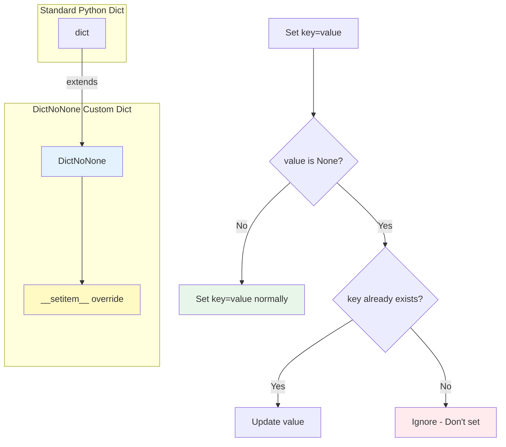
```mermaid
graph TB
    subgraph Standard Python Dict
        A[dict]
    end

    subgraph DictNoNone Custom Dict
        B[DictNoNone]
        C[__setitem__ override]
    end

    A -->|extends| B
    B --> C

    D[Set key=value] --> E{value is None?}
    E -->|Yes| F{key already exists?}
    F -->|Yes| G[Update value]
    F -->|No| H[Ignore - Don't set]
    E -->|No| I[Set key=value normally]

    style B fill:#e3f2fd
    style C fill:#fff9c4
    style H fill:#ffebee
    style I fill:#e8f5e9
```

**Purpose**: Prevents `None` values from polluting message histories. If a key doesn't exist and you try to set it to `None`, the operation is ignored.

**Example**:
```python
messages = DictNoNone()
messages['user1'] = None      # Ignored - key not created
messages['user1'] = []        # Accepted - key created with empty list
messages['user1'] = None      # Accepted - key exists, can be updated
```

---

## Progressive Token Allocation Strategy

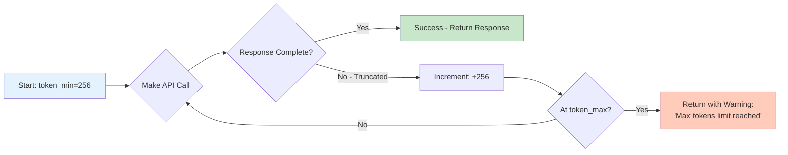
```mermaid
graph LR
    A[Start: token_min=256] --> B{Make API Call}
    B --> C{Response Complete?}

    C -->|Yes| D[Success - Return Response]
    C -->|No - Truncated| E[Increment: +256]

    E --> F{At token_max?}
    F -->|No| B
    F -->|Yes| G[Return with Warning:<br/>'Max tokens limit reached']

    style A fill:#e3f2fd
    style D fill:#c8e6c9
    style G fill:#ffccbc
```

**Benefits**:
- **Cost Optimization**: Start with minimum tokens, only increase when needed
- **Quality Assurance**: Retry with more tokens if response truncated
- **Transparency**: Warn user when max limit reached

**Example Configuration**:
```yaml
tokens_range:
  from: 256        # Start cheap
  until: 4096      # Allow quality
  increment: 256   # Gradual increase
```

**Token Progression**: 256 → 512 → 768 → 1024 → 1280 → ... → 4096

---

## Error Handling Patterns

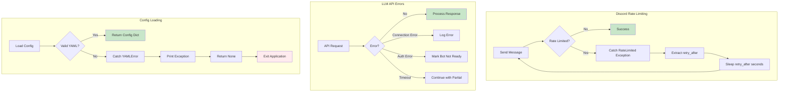
```mermaid
graph TB
    subgraph Discord Rate Limiting
        A[Send Message] --> B{Rate Limited?}
        B -->|No| C[Success]
        B -->|Yes| D[Catch RateLimited Exception]
        D --> E[Extract retry_after]
        E --> F[Sleep retry_after seconds]
        F --> A
    end

    subgraph LLM API Errors
        G[API Request] --> H{Error?}
        H -->|No| I[Process Response]
        H -->|Connection Error| J[Log Error]
        H -->|Auth Error| K[Mark Bot Not Ready]
        H -->|Timeout| L[Continue with Partial]
    end

    subgraph Config Loading
        M[Load Config] --> N{Valid YAML?}
        N -->|Yes| O[Return Config Dict]
        N -->|No| P[Catch YAMLError]
        P --> Q[Print Exception]
        Q --> R[Return None]
        R --> S[Exit Application]
    end

    style C fill:#c8e6c9
    style I fill:#c8e6c9
    style O fill:#c8e6c9
    style S fill:#ffebee
```

---

## Concurrency Model

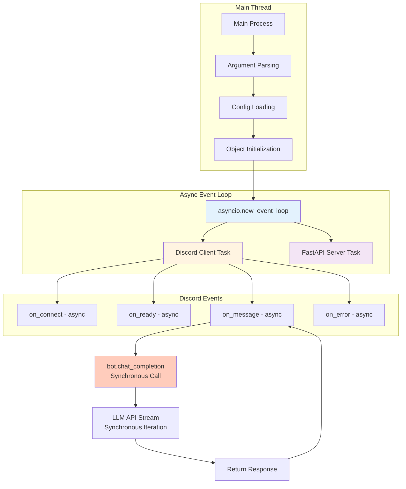
```mermaid
graph TB
    subgraph Main Thread
        A[Main Process]
        B[Argument Parsing]
        C[Config Loading]
        D[Object Initialization]
    end

    subgraph Async Event Loop
        E[asyncio.new_event_loop]
        F[Discord Client Task]
        G[FastAPI Server Task]
    end

    subgraph Discord Events
        H[on_connect - async]
        I[on_ready - async]
        J[on_message - async]
        K[on_error - async]
    end

    A --> B
    B --> C
    C --> D
    D --> E
    E --> F
    E --> G

    F --> H
    F --> I
    F --> J
    F --> K

    J --> L[bot.chat_completion<br/>Synchronous Call]
    L --> M[LLM API Stream<br/>Synchronous Iteration]
    M --> N[Return Response]
    N --> J

    style E fill:#e3f2fd
    style F fill:#fff4e1
    style G fill:#f3e5f5
    style L fill:#ffccbc
```

**Key Points**:
- **Event Loop**: Single async event loop runs both Discord client and FastAPI
- **Discord Handlers**: All event handlers are `async` functions
- **Bot Methods**: `chat_completion()` is synchronous (blocking)
- **LLM Streaming**: Synchronous iteration over response chunks
- **Concurrency**: Multiple users can interact, but each conversation is processed sequentially

---

This document provides comprehensive technical diagrams for understanding AmiBot's architecture, data flows, and operational patterns.

## Proposed Architecture: AgentBot and MCPBot

**Note**: These diagrams represent proposed features detailed in [FEATURE_PROPOSAL_AGENT_MCP.md](FEATURE_PROPOSAL_AGENT_MCP.md).

### Extended Class Hierarchy with New Bot Types

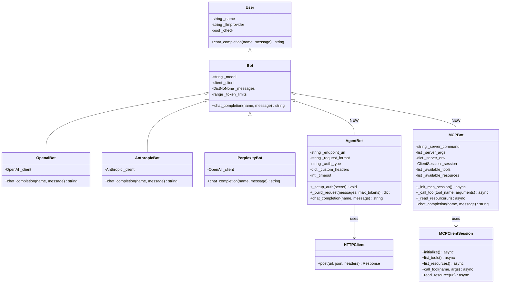
```mermaid
classDiagram
    %% Existing Classes
    class User {
        -string _name
        -string _llmprovider
        -bool _check
        +chat_completion(name, message) string
    }

    class Bot {
        -string _model
        -client _client
        -DictNoNone _messages
        -range _token_limits
        +chat_completion(name, message) string
    }

    %% Existing Bot Implementations
    class OpenaiBot {
        -OpenAI _client
        +chat_completion(name, message) string
    }

    class AnthropicBot {
        -Anthropic _client
        +chat_completion(name, message) string
    }

    class PerplexityBot {
        -OpenAI _client
        +chat_completion(name, message) string
    }

    %% NEW: AgentBot
    class AgentBot {
        -string _endpoint_url
        -string _request_format
        -string _auth_type
        -dict _custom_headers
        -int _timeout
        +_setup_auth(secret) void
        +_build_request(messages, max_tokens) dict
        +chat_completion(name, message) string
    }

    %% NEW: MCPBot
    class MCPBot {
        -string _server_command
        -list _server_args
        -dict _server_env
        -ClientSession _session
        -list _available_tools
        -list _available_resources
        +_init_mcp_session() async
        +_call_tool(tool_name, arguments) async
        +_read_resource(uri) async
        +chat_completion(name, message) string
    }

    %% Relationships
    User <|-- Bot
    Bot <|-- OpenaiBot
    Bot <|-- AnthropicBot
    Bot <|-- PerplexityBot
    Bot <|-- AgentBot : NEW
    Bot <|-- MCPBot : NEW

    %% External Dependencies
    class HTTPClient {
        +post(url, json, headers) Response
    }

    class MCPClientSession {
        +initialize() async
        +list_tools() async
        +list_resources() async
        +call_tool(name, args) async
        +read_resource(uri) async
    }

    AgentBot --> HTTPClient : uses
    MCPBot --> MCPClientSession : uses
```

### AgentBot Message Flow

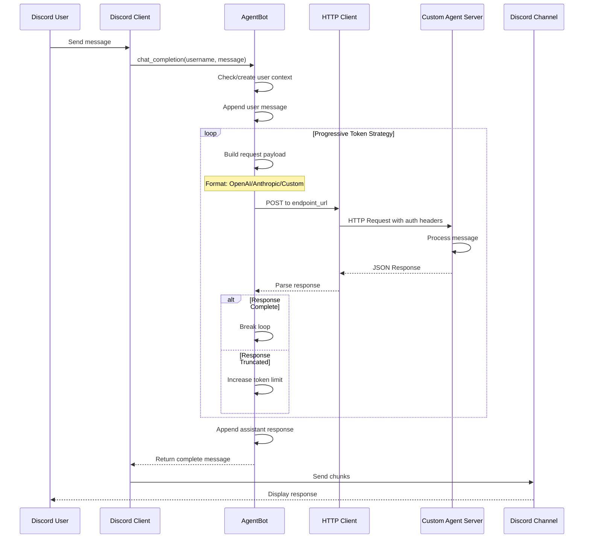
```mermaid
sequenceDiagram
    participant User as Discord User
    participant Discord as Discord Client
    participant AgentBot
    participant HTTPClient as HTTP Client
    participant Agent as Custom Agent Server
    participant Response as Discord Channel

    User->>Discord: Send message
    Discord->>AgentBot: chat_completion(username, message)

    AgentBot->>AgentBot: Check/create user context
    AgentBot->>AgentBot: Append user message

    loop Progressive Token Strategy
        AgentBot->>AgentBot: Build request payload
        Note over AgentBot: Format: OpenAI/Anthropic/Custom

        AgentBot->>HTTPClient: POST to endpoint_url
        HTTPClient->>Agent: HTTP Request with auth headers

        Agent->>Agent: Process message
        Agent-->>HTTPClient: JSON Response

        HTTPClient-->>AgentBot: Parse response

        alt Response Complete
            AgentBot->>AgentBot: Break loop
        else Response Truncated
            AgentBot->>AgentBot: Increase token limit
        end
    end

    AgentBot->>AgentBot: Append assistant response
    AgentBot-->>Discord: Return complete message

    Discord->>Response: Send chunks
    Response-->>User: Display response
```

### MCPBot Tool Calling Flow

```mermaid
sequenceDiagram
    participant User as Discord User
    participant Discord as Discord Client
    participant MCPBot
    participant MCPSession as MCP Client Session
    participant MCPServer as MCP Server
    participant LLM as Underlying LLM
    participant Response as Discord Channel

    User->>Discord: Send message
    Discord->>MCPBot: chat_completion(username, message)

    alt First Call
        MCPBot->>MCPSession: initialize()
        MCPSession->>MCPServer: Connect
        MCPServer-->>MCPSession: Connected
        MCPSession->>MCPServer: list_tools()
        MCPServer-->>MCPSession: Available tools
        MCPSession->>MCPServer: list_resources()
        MCPServer-->>MCPSession: Available resources
    end

    MCPBot->>MCPBot: Build enhanced context
    Note over MCPBot: Include available tools

    MCPBot->>LLM: Send message with tool context
    LLM-->>MCPBot: Response with tool calls

    loop For each tool call
        MCPBot->>MCPSession: call_tool(name, args)
        MCPSession->>MCPServer: Execute tool
        MCPServer-->>MCPSession: Tool result
        MCPSession-->>MCPBot: Result

        MCPBot->>LLM: Send tool results
        LLM-->>MCPBot: Updated response
    end

    MCPBot->>MCPBot: Append final response
    MCPBot-->>Discord: Return complete message

    Discord->>Response: Send chunks
    Response-->>User: Display response
```

### AgentBot Integration Architecture

```mermaid
graph TB
    subgraph Discord Platform
        A[Discord User]
    end

    subgraph AmiBot Application
        B[Discord Client]
        C[AgentBot]
    end

    subgraph Custom Agent Options
        D[Ollama<br/>localhost:11434]
        E[LM Studio<br/>localhost:1234]
        F[vLLM<br/>localhost:8000]
        G[Custom Agent<br/>company.com/api]
        H[LocalAI<br/>localhost:8080]
    end

    A <-->|Messages| B
    B <-->|chat_completion| C

    C -->|HTTP POST<br/>OpenAI Format| D
    C -->|HTTP POST<br/>OpenAI Format| E
    C -->|HTTP POST<br/>OpenAI Format| F
    C -->|HTTP POST<br/>Custom Format| G
    C -->|HTTP POST<br/>OpenAI Format| H

    D -->|JSON Response| C
    E -->|JSON Response| C
    F -->|JSON Response| C
    G -->|JSON Response| C
    H -->|JSON Response| C

    style C fill:#e3f2fd
    style D fill:#c8e6c9
    style E fill:#c8e6c9
    style F fill:#c8e6c9
    style G fill:#fff4e1
    style H fill:#c8e6c9
```

### MCPBot Integration Architecture

```mermaid
graph TB
    subgraph Discord Platform
        A[Discord User]
    end

    subgraph AmiBot Application
        B[Discord Client]
        C[MCPBot]
        D[MCP Client Session]
    end

    subgraph MCP Servers
        E[Filesystem Server<br/>File access]
        F[GitHub Server<br/>Code access]
        G[Database Server<br/>Query data]
        H[Custom MCP Server<br/>Business logic]
    end

    subgraph LLM Backend
        I[Claude/GPT<br/>Decision Making]
    end

    A <-->|Messages| B
    B <-->|chat_completion| C
    C <-->|Async calls| D

    D <-->|stdio/websocket| E
    D <-->|stdio/websocket| F
    D <-->|stdio/websocket| G
    D <-->|stdio/websocket| H

    C <-->|API calls| I

    I -.->|Tool calls| C
    E -.->|Tool results| C
    F -.->|Tool results| C
    G -.->|Tool results| C
    H -.->|Tool results| C

    style C fill:#e3f2fd
    style D fill:#fff4e1
    style I fill:#ffccbc
    style E fill:#c8e6c9
    style F fill:#c8e6c9
    style G fill:#c8e6c9
    style H fill:#c8e6c9
```

### Configuration Comparison

```mermaid
graph LR
    subgraph Existing Bots
        A[OpenAI Config<br/>• provider: openai<br/>• key: sk-...<br/>• model: gpt-4]
        B[Anthropic Config<br/>• provider: anthropic<br/>• key: sk-ant-...<br/>• model: claude-3-5]
    end

    subgraph NEW: Custom Agent Bots
        C[AgentBot Config<br/>• provider: agent<br/>• endpoint_url: localhost:11434<br/>• request_format: openai<br/>• auth_type: none]
        D[MCPBot Config<br/>• provider: mcp<br/>• server_command: npx<br/>• server_args: [...server...]<br/>• llm_backend: anthropic]
    end

    style A fill:#e3f2fd
    style B fill:#e3f2fd
    style C fill:#c8e6c9
    style D fill:#fff9c4
```

### AgentBot Request Formats

```mermaid
graph TB
    A[AgentBot] --> B{Request Format}

    B -->|OpenAI| C[OpenAI Format<br/>messages: array<br/>max_tokens: int<br/>temperature: float]

    B -->|Anthropic| D[Anthropic Format<br/>system: string<br/>messages: array<br/>max_tokens: int]

    B -->|Custom| E[Custom Format<br/>prompt: string<br/>max_length: int<br/>context: array]

    C --> F[Compatible with:<br/>• Ollama<br/>• LM Studio<br/>• vLLM<br/>• LocalAI]

    D --> G[Compatible with:<br/>• Custom Anthropic<br/>• Compatible APIs]

    E --> H[Compatible with:<br/>• Internal systems<br/>• Proprietary agents<br/>• Custom formats]

    style A fill:#e3f2fd
    style C fill:#c8e6c9
    style D fill:#fff9c4
    style E fill:#ffccbc
```

### Deployment Options Comparison

```mermaid
graph TB
    subgraph Current Deployment
        A[AmiBot Pod]
        B[Commercial LLM APIs<br/>OpenAI/Anthropic/Perplexity]
        A -->|Internet| B
    end

    subgraph NEW: AgentBot Deployment
        C[AmiBot Pod]
        D[Sidecar: Local Model<br/>Ollama Container]
        C -->|localhost| D
    end

    subgraph NEW: MCPBot Deployment
        E[AmiBot Pod]
        F[MCP Server Pod<br/>Filesystem/GitHub/etc]
        G[External LLM API<br/>Claude/GPT]
        E -->|Service| F
        E -->|Internet| G
    end

    style A fill:#e3f2fd
    style C fill:#c8e6c9
    style E fill:#fff9c4
```

---

## Implementation Roadmap

### Phase 1: AgentBot (Weeks 1-2)

```mermaid
gantt
    title AgentBot Implementation Timeline
    dateFormat YYYY-MM-DD
    section Design
    Architecture Design           :done, des1, 2025-11-15, 3d
    section Development
    Core Implementation          :active, dev1, 2025-11-18, 5d
    OpenAI Format Support        :dev2, after dev1, 2d
    Custom Format Support        :dev3, after dev2, 2d
    section Testing
    Unit Tests                   :test1, after dev3, 2d
    Integration Tests            :test2, after test1, 2d
    section Documentation
    Update Docs                  :doc1, after test2, 2d
```

### Phase 2: MCPBot (Weeks 3-4)

```mermaid
gantt
    title MCPBot Implementation Timeline
    dateFormat YYYY-MM-DD
    section Design
    MCP Integration Design       :done, des2, 2025-11-15, 3d
    section Development
    MCP Client Setup            :dev4, 2025-11-25, 4d
    Tool Calling Logic          :dev5, after dev4, 3d
    LLM Integration             :dev6, after dev5, 3d
    section Testing
    Unit Tests                  :test3, after dev6, 2d
    Integration Tests           :test4, after test3, 3d
    section Documentation
    Update Docs                 :doc2, after test4, 2d
```

---

This document now includes comprehensive diagrams for both existing and proposed AmiBot architectures.

## Proposed Architecture: Slack and Signal Communities

**Note**: These diagrams represent proposed features detailed in [FEATURE_PROPOSAL_SLACK_SIGNAL.md](FEATURE_PROPOSAL_SLACK_SIGNAL.md).

### Extended Community Class Hierarchy

```mermaid
classDiagram
    %% Base Class
    class Community {
        -string _platform
        -string _secret
        -Bot _bot
        -bool _check
        +__init__(platform, secret)
        +is_ready() bool
        +start() async
        +stop() async
        +bot property
    }

    %% Existing Implementation
    class Discord {
        -Client client
        +__init__(secret)
        +on_connect() async
        +on_ready() async
        +on_message(msg) async
        +split_into_chunks(message) list
    }

    %% NEW: Slack Implementation
    class Slack {
        -AsyncApp app
        -str _app_token
        -AsyncSocketModeHandler _handler
        +__init__(bot_token, app_token, signing_secret)
        +_register_handlers() void
        +_handle_message(event, say, client) async
        +_split_message(message) list
    }

    %% NEW: Signal Implementation
    class Signal {
        -str _phone_number
        -str _signal_cli_path
        -Queue _message_queue
        -Thread _receive_thread
        +__init__(phone_number, signal_cli_path)
        +_run_signal_command(command) str
        +_receive_messages() void
        +_process_messages() async
        +_send_message(recipient, message) async
    }

    %% Relationships
    Community <|-- Discord : existing
    Community <|-- Slack : NEW
    Community <|-- Signal : NEW

    %% External Dependencies
    class DiscordPy {
        +Client
        +Intents
    }

    class SlackBolt {
        +AsyncApp
        +AsyncSocketModeHandler
    }

    class SignalCLI {
        +daemon
        +send
        +receive
    }

    Discord --> DiscordPy : uses
    Slack --> SlackBolt : uses
    Signal --> SignalCLI : uses
```

### Slack Integration Architecture

```mermaid
sequenceDiagram
    participant User as Slack User
    participant Workspace as Slack Workspace
    participant SocketMode as Socket Mode Handler
    participant SlackBot as Slack Community
    participant Bot as Bot Instance
    participant LLM as LLM Provider

    User->>Workspace: @mentions bot / sends DM
    Workspace->>SocketMode: Event via WebSocket

    SocketMode->>SlackBot: app_mention or message event

    SlackBot->>SlackBot: Extract user, text, channel
    SlackBot->>Workspace: Get user info

    SlackBot->>Bot: chat_completion(username, message)
    Bot->>LLM: Stream request
    LLM-->>Bot: Response chunks
    Bot-->>SlackBot: Complete response

    SlackBot->>SlackBot: Split message if needed

    loop For each chunk
        SlackBot->>Workspace: Post message in thread
        Workspace-->>User: Display response
    end
```

### Signal Integration Architecture

```mermaid
sequenceDiagram
    participant User as Signal User
    participant SignalNetwork as Signal Network
    participant SignalCLI as signal-cli daemon
    participant SignalBot as Signal Community
    participant Bot as Bot Instance
    participant LLM as LLM Provider

    User->>SignalNetwork: Send encrypted message
    SignalNetwork->>SignalCLI: Deliver message

    SignalCLI->>SignalCLI: Decrypt with local keys
    SignalCLI->>SignalBot: JSON message via stdout

    SignalBot->>SignalBot: Parse JSON
    SignalBot->>SignalBot: Queue message

    SignalBot->>Bot: chat_completion(username, message)
    Bot->>LLM: API request
    LLM-->>Bot: Response
    Bot-->>SignalBot: Complete response

    SignalBot->>SignalCLI: send command
    SignalCLI->>SignalCLI: Encrypt with Signal protocol
    SignalCLI->>SignalNetwork: Send encrypted message
    SignalNetwork-->>User: Deliver message
```

### Multi-Platform Deployment

```mermaid
graph TB
    subgraph Users
        A[Discord User]
        B[Slack User]
        C[Signal User]
    end

    subgraph Platform Services
        D[Discord API]
        E[Slack Workspace]
        F[Signal Network]
    end

    subgraph AmiBot Pod
        G[Discord Community]
        H[Slack Community]
        I[Signal Community]
        J[Bot Instance<br/>Shared]
    end

    subgraph Backend
        K[LLM Provider<br/>OpenAI/Anthropic/etc]
    end

    A <-->|WebSocket| D
    B <-->|Socket Mode| E
    C <-->|Encrypted| F

    D <-->|discord.py| G
    E <-->|Slack Bolt| H
    F <-->|signal-cli| I

    G -->|chat_completion| J
    H -->|chat_completion| J
    I -->|chat_completion| J

    J <-->|API| K

    style G fill:#e3f2fd
    style H fill:#fff4e1
    style I fill:#c8e6c9
    style J fill:#ffccbc
```

### Platform Message Flow Comparison

```mermaid
graph LR
    subgraph Discord Flow
        A1[User Message] --> A2[WebSocket Event]
        A2 --> A3[on_message]
        A3 --> A4[Check Mention/DM]
        A4 --> A5[bot.chat_completion]
        A5 --> A6[Chunk 2000 chars]
        A6 --> A7[Send to Channel]
    end

    subgraph Slack Flow
        B1[User Message] --> B2[Socket Mode Event]
        B2 --> B3[app_mention/message]
        B3 --> B4[Extract User Info]
        B4 --> B5[bot.chat_completion]
        B5 --> B6[Chunk 3000 chars]
        B6 --> B7[Post in Thread]
    end

    subgraph Signal Flow
        C1[User Message] --> C2[signal-cli daemon]
        C2 --> C3[JSON stdout]
        C3 --> C4[Queue Message]
        C4 --> C5[bot.chat_completion]
        C5 --> C6[Chunk 2000 chars]
        C6 --> C7[signal-cli send]
    end

    style A5 fill:#ffccbc
    style B5 fill:#ffccbc
    style C5 fill:#ffccbc
```

### Slack App Configuration

```mermaid
graph TB
    A[Create Slack App] --> B[Enable Socket Mode]
    B --> C[Add Bot Scopes]
    C --> D[Subscribe to Events]
    D --> E[Install to Workspace]
    E --> F[Copy Tokens]

    C --> C1[app_mentions:read]
    C --> C2[chat:write]
    C --> C3[im:history]
    C --> C4[im:write]
    C --> C5[users:read]

    D --> D1[app_mention]
    D --> D2[message.im]
    D --> D3[app_home_opened]

    F --> F1[Bot Token<br/>xoxb-...]
    F --> F2[App Token<br/>xapp-...]
    F --> F3[Signing Secret]

    style A fill:#e3f2fd
    style F1 fill:#c8e6c9
    style F2 fill:#c8e6c9
    style F3 fill:#c8e6c9
```

### Signal Setup Flow

```mermaid
graph TB
    A[Install signal-cli] --> B{Registration Method}

    B -->|New Number| C[Register Number]
    C --> D[Receive SMS Code]
    D --> E[Verify with Code]

    B -->|Existing Account| F[Link Device]
    F --> G[Generate QR Code]
    G --> H[Scan with Signal App]

    E --> I[Test Send]
    H --> I

    I --> J[Start Daemon Mode]
    J --> K[Configure AmiBot]

    style A fill:#e3f2fd
    style C fill:#fff4e1
    style F fill:#fff9c4
    style K fill:#c8e6c9
```

### Configuration Patterns

```mermaid
graph TB
    subgraph Single Platform
        A[Configuration File]
        A --> B[Discord Only]
        B --> C[One Community<br/>One Bot]
    end

    subgraph Multi-Platform Same Bot
        D[Configuration File]
        D --> E1[Discord Enabled]
        D --> E2[Slack Enabled]
        D --> E3[Signal Enabled]
        E1 --> F[Shared Bot Instance]
        E2 --> F
        E3 --> F
    end

    subgraph Multi-Platform Different Bots
        G[Configuration File]
        G --> H1[Discord + OpenAI Bot]
        G --> H2[Slack + Anthropic Bot]
        G --> H3[Signal + Local Agent Bot]
        H1 --> I1[Bot Instance 1]
        H2 --> I2[Bot Instance 2]
        H3 --> I3[Bot Instance 3]
    end

    style C fill:#e3f2fd
    style F fill:#c8e6c9
    style I1 fill:#fff4e1
    style I2 fill:#fff9c4
    style I3 fill:#ffccbc
```

### Platform Feature Matrix

```mermaid
graph LR
    subgraph Feature Support
        A[Rich Formatting]
        B[Threading]
        C[Encryption]
        D[File Sharing]
        E[Reactions]
        F[Edit Messages]
    end

    subgraph Discord
        A --> A1[✅ Markdown]
        B --> B1[✅ Threads]
        C --> C1[❌ No E2E]
        D --> D1[✅ Full Support]
        E --> E1[✅ Emojis]
        F --> F1[✅ Yes]
    end

    subgraph Slack
        A --> A2[✅ mrkdwn]
        B --> B2[✅ Threads]
        C --> C2[❌ No E2E]
        D --> D2[✅ Full Support]
        E --> E2[✅ Reactions]
        F --> F2[✅ Yes]
    end

    subgraph Signal
        A --> A3[⚠️ Limited]
        B --> B3[⚠️ Quotes Only]
        C --> C3[✅ E2E Default]
        D --> D3[✅ Full Support]
        E --> E3[✅ Reactions]
        F --> F3[❌ No]
    end

    style A1 fill:#c8e6c9
    style A2 fill:#c8e6c9
    style C3 fill:#c8e6c9
```

### Error Handling Per Platform

```mermaid
graph TB
    subgraph Discord Error Handling
        A1[Rate Limited] --> A2[Sleep retry_after]
        A3[Connection Lost] --> A4[Auto Reconnect]
        A5[Invalid Token] --> A6[Mark Not Ready]
    end

    subgraph Slack Error Handling
        B1[Rate Limited] --> B2[Exponential Backoff]
        B3[Socket Disconnected] --> B4[Handler Reconnects]
        B5[Invalid Token] --> B6[Mark Not Ready]
    end

    subgraph Signal Error Handling
        C1[signal-cli Crash] --> C2[Restart Daemon]
        C3[Send Failed] --> C4[Retry Queue]
        C5[Parse Error] --> C6[Skip Message]
    end

    style A2 fill:#fff9c4
    style B2 fill:#fff9c4
    style C2 fill:#fff9c4
```

---

This document now includes comprehensive diagrams for both existing (Discord) and proposed (Slack, Signal) community platform integrations.
